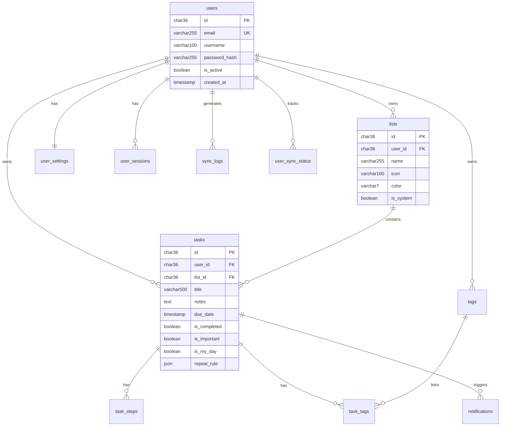

# Jarvis ToDo App - 数据库设计文档 📊

## 概述

本文档详细描述了 Jarvis 待办应用的 MySQL 数据库设计，包含完整的表结构、关系设计、索引优化和最佳实践。

## 📋 目录

- [数据库概览](#数据库概览)
- [表结构设计](#表结构设计)
- [关系图](#关系图)
- [核心功能支持](#核心功能支持)
- [性能优化](#性能优化)
- [安全考虑](#安全考虑)
- [部署指南](#部署指南)

---

## 数据库概览

### 基本信息
- **数据库名称**: `jarvis_todo`
- **字符集**: `utf8mb4`
- **排序规则**: `utf8mb4_unicode_ci`
- **MySQL 版本要求**: 8.0+
- **存储引擎**: InnoDB

### 表统计
| 类别 | 表数量 | 描述 |
|------|--------|------|
| 核心业务表 | 6 | 用户、清单、任务、步骤、标签、关联 |
| 认证会话表 | 2 | 用户设置、会话管理 |
| 通知系统表 | 1 | 推送通知记录 |
| 同步系统表 | 2 | 数据同步、版本控制 |
| 系统管理表 | 3 | 审计日志、配置、版本 |
| **总计** | **14** | |

---

## 表结构设计

### 1. 用户管理模块 👤

#### `users` - 用户表
```sql
-- 核心用户信息，支持邮箱登录和多设备同步
CREATE TABLE `users` (
    `id` CHAR(36) PRIMARY KEY,           -- UUID主键
    `email` VARCHAR(255) UNIQUE,         -- 登录邮箱
    `username` VARCHAR(100),             -- 显示名称
    `password_hash` VARCHAR(255),        -- 密码哈希
    `avatar_url` VARCHAR(500),           -- 头像URL
    `is_active` BOOLEAN DEFAULT TRUE,    -- 账户状态
    `email_verified` BOOLEAN DEFAULT FALSE, -- 邮箱验证状态
    `timezone` VARCHAR(50) DEFAULT 'UTC',  -- 用户时区
    `created_at` TIMESTAMP DEFAULT CURRENT_TIMESTAMP,
    `updated_at` TIMESTAMP DEFAULT CURRENT_TIMESTAMP ON UPDATE CURRENT_TIMESTAMP,
    `last_login_at` TIMESTAMP NULL
);
```

**设计要点:**
- 使用 UUID 作为主键，便于分布式系统
- 邮箱作为唯一登录标识
- 支持时区设置，确保跨地区用户体验
- 密码使用 bcrypt 等安全哈希算法

#### `user_settings` - 用户设置表
```sql
-- 用户个性化设置，一对一关系
CREATE TABLE `user_settings` (
    `user_id` CHAR(36),
    `sync_enabled` BOOLEAN DEFAULT TRUE,
    `default_reminder_minutes` INT DEFAULT 15,
    `theme` TINYINT DEFAULT 0,           -- 0:系统 1:浅色 2:深色
    `notification_enabled` BOOLEAN DEFAULT TRUE,
    `auto_add_to_myday` BOOLEAN DEFAULT FALSE,
    FOREIGN KEY (`user_id`) REFERENCES `users`(`id`) ON DELETE CASCADE
);
```

#### `user_sessions` - 会话管理表
```sql
-- 多设备登录会话管理
CREATE TABLE `user_sessions` (
    `user_id` CHAR(36),
    `session_token` VARCHAR(255) UNIQUE,
    `refresh_token` VARCHAR(255) UNIQUE,
    `device_type` VARCHAR(50),           -- iOS/macOS/web
    `device_name` VARCHAR(100),
    `expires_at` TIMESTAMP,
    `last_used_at` TIMESTAMP DEFAULT CURRENT_TIMESTAMP,
    FOREIGN KEY (`user_id`) REFERENCES `users`(`id`) ON DELETE CASCADE
);
```

### 2. 清单管理模块 📂

#### `lists` - 清单表
```sql
-- 任务分组管理，支持系统和自定义清单
CREATE TABLE `lists` (
    `id` CHAR(36) PRIMARY KEY,
    `user_id` CHAR(36),
    `name` VARCHAR(255),
    `icon` VARCHAR(100),                 -- 图标名称
    `color` VARCHAR(7),                  -- hex颜色值
    `is_system` BOOLEAN DEFAULT FALSE,   -- 系统清单标识
    `sort_index` INT DEFAULT 0,
    `is_shared` BOOLEAN DEFAULT FALSE,   -- 预留共享功能
    FOREIGN KEY (`user_id`) REFERENCES `users`(`id`) ON DELETE CASCADE
);
```

**系统清单类型:**
- 我的一天 (My Day)
- 已计划 (Planned) 
- 重要 (Important)
- 已完成 (Completed)

### 3. 任务管理模块 ✅

#### `tasks` - 任务表
```sql
-- 核心任务实体，支持丰富的任务属性
CREATE TABLE `tasks` (
    `id` CHAR(36) PRIMARY KEY,
    `user_id` CHAR(36),
    `list_id` CHAR(36),
    `title` VARCHAR(500),
    `notes` TEXT,
    `due_date` TIMESTAMP NULL,           -- 截止日期
    `reminder_date` TIMESTAMP NULL,      -- 提醒时间
    `is_completed` BOOLEAN DEFAULT FALSE,
    `completed_at` TIMESTAMP NULL,       -- 完成时间（自动设置）
    `is_important` BOOLEAN DEFAULT FALSE,
    `is_my_day` BOOLEAN DEFAULT FALSE,   -- 我的一天标记
    `repeat_rule` JSON NULL,             -- 重复规则JSON
    `sort_index` BIGINT DEFAULT 0,       -- 排序索引
    `parent_task_id` CHAR(36) NULL,      -- 支持子任务
    FOREIGN KEY (`user_id`) REFERENCES `users`(`id`) ON DELETE CASCADE,
    FOREIGN KEY (`list_id`) REFERENCES `lists`(`id`) ON DELETE CASCADE
);
```

**重复规则 JSON 格式:**
```json
{
  "kind": "weekly",                      // daily/weekly/monthly/none
  "weekdays": [1, 3, 5],                // 周一、三、五
  "dayOfMonth": 15,                     // 每月15日
  "isLastDayOfMonth": false
}
```

#### `task_steps` - 任务步骤表
```sql
-- 任务的子步骤，支持复杂任务分解
CREATE TABLE `task_steps` (
    `id` CHAR(36) PRIMARY KEY,
    `task_id` CHAR(36),
    `title` VARCHAR(500),
    `is_completed` BOOLEAN DEFAULT FALSE,
    `sort_index` INT DEFAULT 0,
    FOREIGN KEY (`task_id`) REFERENCES `tasks`(`id`) ON DELETE CASCADE
);
```

### 4. 标签系统模块 🏷️

#### `tags` - 标签表
```sql
-- 用户自定义标签，支持任务分类
CREATE TABLE `tags` (
    `id` CHAR(36) PRIMARY KEY,
    `user_id` CHAR(36),
    `name` VARCHAR(100),
    `color` VARCHAR(7),
    `usage_count` INT DEFAULT 0,         -- 使用统计
    FOREIGN KEY (`user_id`) REFERENCES `users`(`id`) ON DELETE CASCADE,
    UNIQUE KEY (`user_id`, `name`)       -- 用户内标签名唯一
);
```

#### `task_tags` - 任务标签关联表
```sql
-- 多对多关系：任务可以有多个标签
CREATE TABLE `task_tags` (
    `task_id` CHAR(36),
    `tag_id` CHAR(36),
    FOREIGN KEY (`task_id`) REFERENCES `tasks`(`id`) ON DELETE CASCADE,
    FOREIGN KEY (`tag_id`) REFERENCES `tags`(`id`) ON DELETE CASCADE,
    UNIQUE KEY (`task_id`, `tag_id`)
);
```

### 5. 通知系统模块 🔔

#### `notifications` - 通知记录表
```sql
-- 推送通知管理，支持多种通知类型
CREATE TABLE `notifications` (
    `user_id` CHAR(36),
    `task_id` CHAR(36) NULL,
    `type` VARCHAR(50),                  -- reminder/due/shared等
    `title` VARCHAR(255),
    `body` TEXT,
    `scheduled_at` TIMESTAMP,            -- 计划发送时间
    `sent_at` TIMESTAMP NULL,            -- 实际发送时间
    `status` ENUM('pending', 'sent', 'failed', 'cancelled'),
    `device_tokens` JSON NULL,           -- 设备推送令牌
    FOREIGN KEY (`user_id`) REFERENCES `users`(`id`) ON DELETE CASCADE
);
```

### 6. 同步系统模块 🔄

#### `sync_logs` - 同步日志表
```sql
-- 数据变更记录，支持多设备同步
CREATE TABLE `sync_logs` (
    `user_id` CHAR(36),
    `entity_type` VARCHAR(50),           -- task/list/tag等
    `entity_id` CHAR(36),
    `action` VARCHAR(20),                -- create/update/delete
    `device_id` VARCHAR(255),
    `sync_version` BIGINT,               -- 递增版本号
    `data_snapshot` JSON NULL,           -- 数据快照
    FOREIGN KEY (`user_id`) REFERENCES `users`(`id`) ON DELETE CASCADE
);
```

#### `user_sync_status` - 用户同步状态表
```sql
-- 各设备同步状态跟踪
CREATE TABLE `user_sync_status` (
    `user_id` CHAR(36),
    `device_id` VARCHAR(255),
    `last_sync_version` BIGINT DEFAULT 0,
    `last_sync_at` TIMESTAMP DEFAULT CURRENT_TIMESTAMP,
    FOREIGN KEY (`user_id`) REFERENCES `users`(`id`) ON DELETE CASCADE,
    UNIQUE KEY (`user_id`, `device_id`)
);
```

---

## 关系图



---

## 核心功能支持

### 1. 智能列表查询 🎯

#### 我的一天
```sql
SELECT t.* FROM tasks t 
WHERE t.user_id = ? 
  AND t.is_my_day = TRUE 
  AND t.is_completed = FALSE
ORDER BY t.sort_index, t.updated_at DESC;
```

#### 已计划任务
```sql
SELECT t.* FROM tasks t 
WHERE t.user_id = ? 
  AND (t.due_date IS NOT NULL OR t.reminder_date IS NOT NULL)
  AND t.is_completed = FALSE
ORDER BY COALESCE(t.due_date, t.reminder_date);
```

#### 重要任务
```sql
SELECT t.* FROM tasks t 
WHERE t.user_id = ? 
  AND t.is_important = TRUE 
  AND t.is_completed = FALSE
ORDER BY t.due_date ASC NULLS LAST;
```

#### 逾期任务
```sql
SELECT t.* FROM tasks t 
WHERE t.user_id = ? 
  AND t.due_date < NOW() 
  AND t.is_completed = FALSE
ORDER BY t.due_date;
```

### 2. 高级搜索 🔍

#### 全文搜索
```sql
SELECT t.*, l.name as list_name
FROM tasks t
JOIN lists l ON t.list_id = l.id
WHERE t.user_id = ?
  AND (t.title LIKE ? OR t.notes LIKE ?)
ORDER BY t.updated_at DESC;
```

#### 标签搜索
```sql
SELECT DISTINCT t.*
FROM tasks t
JOIN task_tags tt ON t.id = tt.task_id
JOIN tags tag ON tt.tag_id = tag.id
WHERE t.user_id = ? AND tag.name IN (?)
ORDER BY t.updated_at DESC;
```

### 3. 数据统计 📈

#### 用户任务概览
```sql
-- 使用预定义视图
SELECT * FROM v_user_task_stats WHERE user_id = ?;
```

#### 清单完成率
```sql
SELECT 
    l.name,
    COUNT(t.id) as total_tasks,
    COUNT(CASE WHEN t.is_completed = 1 THEN 1 END) as completed_tasks,
    ROUND(COUNT(CASE WHEN t.is_completed = 1 THEN 1 END) * 100.0 / COUNT(t.id), 2) as completion_rate
FROM lists l
LEFT JOIN tasks t ON l.id = t.list_id
WHERE l.user_id = ?
GROUP BY l.id, l.name;
```

---

## 性能优化

### 1. 索引策略 ⚡

#### 核心查询索引
```sql
-- 用户任务查询
CREATE INDEX idx_user_tasks ON tasks(user_id, is_completed);

-- 清单任务排序
CREATE INDEX idx_list_tasks ON tasks(list_id, sort_index);

-- 日期相关查询
CREATE INDEX idx_due_date ON tasks(due_date);
CREATE INDEX idx_reminder_date ON tasks(reminder_date);

-- 智能列表查询
CREATE INDEX idx_important ON tasks(is_important, is_completed);
CREATE INDEX idx_my_day ON tasks(is_my_day, is_completed);

-- 标签查询优化
CREATE INDEX idx_tag_tasks ON task_tags(tag_id);

-- 同步查询优化
CREATE INDEX idx_user_sync ON sync_logs(user_id, sync_version);
```

#### 复合索引说明
```sql
-- 支持多条件查询的复合索引
CREATE INDEX idx_user_list_completed ON tasks(user_id, list_id, is_completed);
CREATE INDEX idx_user_date_completed ON tasks(user_id, due_date, is_completed);
```

### 2. 查询优化建议 🚀

#### 批量操作
```sql
-- 批量标记完成（避免逐条更新）
UPDATE tasks 
SET is_completed = TRUE, completed_at = NOW(), updated_at = NOW()
WHERE id IN (?, ?, ?, ...);
```

#### 分页查询
```sql
-- 使用游标分页提升性能
SELECT * FROM tasks 
WHERE user_id = ? AND id > ?
ORDER BY id 
LIMIT 20;
```

#### 预加载关联数据
```sql
-- 一次查询获取任务及其步骤
SELECT 
    t.*,
    GROUP_CONCAT(s.title ORDER BY s.sort_index) as steps
FROM tasks t
LEFT JOIN task_steps s ON t.id = s.task_id
WHERE t.user_id = ?
GROUP BY t.id;
```

### 3. 存储优化 💾

#### JSON 字段使用
```sql
-- 重复规则存储示例
UPDATE tasks 
SET repeat_rule = JSON_OBJECT(
    'kind', 'weekly',
    'weekdays', JSON_ARRAY(1, 3, 5)
)
WHERE id = ?;

-- JSON 查询
SELECT * FROM tasks 
WHERE JSON_EXTRACT(repeat_rule, '$.kind') = 'daily';
```

#### 归档策略
```sql
-- 定期归档已完成任务（超过6个月）
CREATE TABLE tasks_archive LIKE tasks;

INSERT INTO tasks_archive 
SELECT * FROM tasks 
WHERE is_completed = TRUE 
  AND completed_at < DATE_SUB(NOW(), INTERVAL 6 MONTH);

DELETE FROM tasks 
WHERE is_completed = TRUE 
  AND completed_at < DATE_SUB(NOW(), INTERVAL 6 MONTH);
```

---

## 安全考虑

### 1. 数据安全 🔒

#### 密码安全
```php
// PHP 示例：密码哈希
$password_hash = password_hash($password, PASSWORD_ARGON2ID);

// 验证
if (password_verify($password, $stored_hash)) {
    // 密码正确
}
```

#### SQL 注入防护
```sql
-- 使用参数化查询
PREPARE stmt FROM 'SELECT * FROM tasks WHERE user_id = ? AND title LIKE ?';
SET @user_id = '550e8400-e29b-41d4-a716-446655440001';
SET @title = '%meeting%';
EXECUTE stmt USING @user_id, @title;
```

### 2. 权限控制 👮‍♀️

#### 行级安全
```sql
-- 创建安全视图，确保用户只能访问自己的数据
CREATE VIEW secure_tasks AS
SELECT * FROM tasks 
WHERE user_id = USER_ID();

-- 应用层验证
SELECT * FROM tasks 
WHERE id = ? AND user_id = ?;  -- 必须同时验证ID和用户ID
```

#### 审计日志
```sql
-- 敏感操作记录
INSERT INTO audit_logs (user_id, action, resource_type, resource_id, ip_address)
VALUES (?, 'delete_task', 'task', ?, ?);
```

### 3. 数据备份 💿

#### 备份策略
```bash
# 每日全量备份
mysqldump --single-transaction jarvis_todo > backup_$(date +%Y%m%d).sql

# 增量备份（基于 binlog）
mysqlbinlog --start-datetime="2024-01-01 00:00:00" mysql-bin.000001
```

---

## 部署指南

### 1. 环境要求 🛠️

#### 系统要求
- **MySQL**: 8.0.25+
- **内存**: 最少 4GB RAM
- **存储**: SSD 推荐，最少 100GB
- **网络**: 千兆网络

#### 配置优化
```ini
# my.cnf 优化配置
[mysqld]
innodb_buffer_pool_size = 2G          # 设置为可用内存的70%
innodb_log_file_size = 512M
innodb_flush_log_at_trx_commit = 2     # 性能与安全的平衡
query_cache_type = 0                   # MySQL 8.0 已移除
max_connections = 1000
```

### 2. 部署步骤 🚀

#### 1. 创建数据库
```bash
mysql -u root -p < database_schema.sql
```

#### 2. 插入示例数据（可选）
```bash
mysql -u root -p jarvis_todo < sample_data.sql
```

#### 3. 创建应用用户
```sql
CREATE USER 'jarvis_app'@'%' IDENTIFIED BY 'secure_password';
GRANT SELECT, INSERT, UPDATE, DELETE ON jarvis_todo.* TO 'jarvis_app'@'%';
FLUSH PRIVILEGES;
```

#### 4. 设置定时任务
```bash
# 添加到 crontab
0 0 * * * mysql -u jarvis_app -p jarvis_todo -e "CALL CleanupMyDayTasks();"
0 2 * * 0 mysql -u jarvis_app -p jarvis_todo -e "DELETE FROM user_sessions WHERE expires_at < NOW();"
```

### 3. 监控指标 📊

#### 关键监控点
```sql
-- 活跃用户数
SELECT COUNT(DISTINCT user_id) FROM user_sessions 
WHERE last_used_at > DATE_SUB(NOW(), INTERVAL 24 HOUR);

-- 任务创建趋势
SELECT DATE(created_at) as date, COUNT(*) as tasks_created
FROM tasks 
WHERE created_at > DATE_SUB(NOW(), INTERVAL 30 DAY)
GROUP BY DATE(created_at);

-- 存储使用情况
SELECT 
    table_name,
    ROUND(((data_length + index_length) / 1024 / 1024), 2) AS 'Size (MB)'
FROM information_schema.tables 
WHERE table_schema = 'jarvis_todo'
ORDER BY (data_length + index_length) DESC;
```

---

## 最佳实践

### 1. 开发建议 💡

#### 连接池配置
```yaml
# 应用配置示例
database:
  host: localhost
  port: 3306
  database: jarvis_todo
  username: jarvis_app
  password: ${DB_PASSWORD}
  pool:
    min_connections: 5
    max_connections: 20
    max_idle_time: 300
```

#### 查询优化
```sql
-- 使用 EXPLAIN 分析查询计划
EXPLAIN SELECT * FROM tasks 
WHERE user_id = '550e8400-e29b-41d4-a716-446655440001' 
  AND is_completed = FALSE;

-- 避免 SELECT *，明确指定字段
SELECT id, title, due_date, is_important 
FROM tasks 
WHERE user_id = ? AND is_completed = FALSE;
```

### 2. 运维建议 🔧

#### 定期维护
```sql
-- 重建索引（根据需要）
OPTIMIZE TABLE tasks;

-- 更新统计信息
ANALYZE TABLE tasks, lists, tags;

-- 检查表完整性
CHECK TABLE tasks;
```

#### 容量规划
```sql
-- 估算存储增长
SELECT 
    table_name,
    table_rows,
    ROUND(((data_length + index_length) / 1024 / 1024), 2) AS 'Size (MB)',
    ROUND((data_length / table_rows), 2) AS 'Avg Row Size (bytes)'
FROM information_schema.tables 
WHERE table_schema = 'jarvis_todo' AND table_rows > 0;
```

---

## 版本升级

### 版本管理策略 🔄

#### 数据库版本控制
```sql
-- 检查当前版本
SELECT version FROM schema_versions ORDER BY applied_at DESC LIMIT 1;

-- 升级脚本示例（v1.1.0）
INSERT INTO schema_versions (version, description) VALUES 
('1.1.0', '添加任务优先级字段');

ALTER TABLE tasks ADD COLUMN priority TINYINT DEFAULT 1 COMMENT '优先级：1-低，2-中，3-高';
CREATE INDEX idx_priority ON tasks(priority, is_completed);
```

#### 迁移检查清单
- [ ] 备份现有数据
- [ ] 测试环境验证
- [ ] 应用停机维护
- [ ] 执行升级脚本
- [ ] 数据完整性检查
- [ ] 应用启动验证

---

## 总结

这套数据库设计为 Jarvis 待办应用提供了：

✅ **完整的功能支持**: 覆盖用户管理、任务管理、同步等所有核心功能  
✅ **高性能设计**: 合理的索引策略和查询优化  
✅ **安全可靠**: 完善的权限控制和审计机制  
✅ **易于扩展**: 模块化设计支持功能扩展  
✅ **运维友好**: 完整的监控、备份、升级策略  

通过遵循本文档的设计和最佳实践，可以构建一个稳定、高效的待办应用数据库系统。

---

**文档版本**: 1.0  
**最后更新**: 2024-08-17  
**维护者**: Jarvis 开发团队
